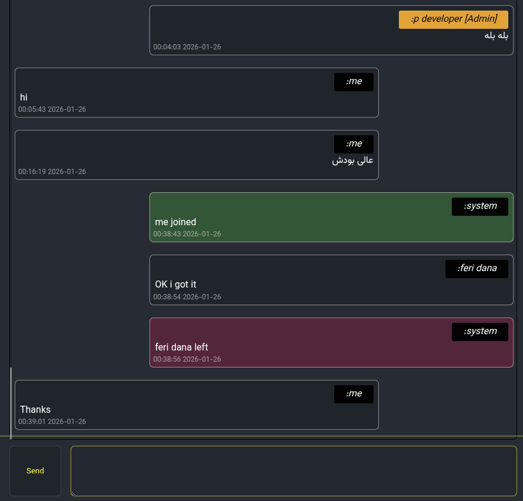

# 🟢 Minimal Rust&Python WebSocket Chat

A **minimal, lightweight WebSocket chat server** written in **Rust** using **Axum**. Designed for **high performance, low-resource servers**, and resilient in **unstable network environments**.

> This project intentionally keeps things **simple, minimal, and fast**, suitable for emergency communication, internal team chat, or environments where messaging platforms are unreliable.


---

## ✨ Features

* ⚡ **Extremely lightweight & fast** (async, Tokio-based)
* 🔌 **WebSocket-based real-time messaging**
* 📦 **JSON message format**, easy to parse for any client
* 🧠 **In-memory message history** (last 50 messages)
* 👤 **User roles**: User / Admin
* 🔐 **Admin authentication** via environment variable
* 🌍 **Client IP detection**, compatible with reverse proxies (Nginx)
* 🧩 Minimal **client-agnostic** design
* 💾 **No database required**
* 📄 **Environment-configurable** (`BIND_ADDR` and `TOKEN`)

---

## 📡 Architecture

```text
  ┌──────────────┐      WebSocket       ┌───────────────┐
  │  Frontend    │  <----------------> │  Rust Backend │
  │  (Any client)│                     │  Axum + Tokio │
  └──────────────┘                     └───────────────┘
           │                                   │
           │                                   │
           │                                   │
           │                                   │
           │                                   ▼
           │                            ┌─────────────┐
           │                            │ Broadcast   │
           │                            │ Channel     │
           │                            └─────────────┘
           │                                   │
           ▼                                   ▼
   WebSocket messages                  Last 50 messages
      sent/received                         in-memory
```

* **Frontend** can be any client (Vue, React, Flutter, etc.)
* **Backend** manages broadcasting, user join/leave, and keeps last 50 messages in memory
* All messages are **JSON arrays** for consistent client handling

---

## 🧱 Message Format

All messages are sent as **JSON arrays**, even single messages:

```json
[
  {
    "text": "Hello world",
    "time": "2026-01-26T12:34:56Z",
    "username": "alice",
    "role": "User",
    "type": "message"
  }
]
```

| Field    | Type   | Description                |
| -------- | ------ | -------------------------- |
| text     | string | Message content            |
| time     | string | ISO-8601 timestamp         |
| username | string | Sender username            |
| role     | string | `User` or `Admin`          |
| type     | string | `join`, `leave`, `message` |

* When a new client connects, **all stored messages** (up to last 50) are sent as a **single array**.
* Every new message is also sent as an array, ensuring **consistent client handling**.

---

## 🔧 Environment Variables

| Variable  | Description                | Default          |
| --------- | -------------------------- | ---------------- |
| BIND_ADDR | Server bind address        | `127.0.0.1:3000` |
| TOKEN     | Admin authentication token | `token`          |

Example:

```bash
export BIND_ADDR=0.0.0.0:3000
export TOKEN=super-secret-token
```


---

## How become an admin

use your username at start like `username+::+token` example: (John) (put your token here)

```
John::super-secret-token
```

---

## 🌐 Reverse Proxy (Nginx)

Supports running behind **Nginx with HTTPS**.

Required configuration for WebSocket upgrade and IP forwarding:

```nginx
proxy_set_header X-Real-IP $remote_addr;
proxy_set_header X-Forwarded-For $proxy_add_x_forwarded_for;

proxy_set_header Upgrade $http_upgrade;
proxy_set_header Connection "upgrade";
proxy_http_version 1.1;
```

* Backend extracts **client IP** from `X-Forwarded-For` if present
* Works with **wss://** (HTTPS) and **ws://**

---

## 🚀 Running the Rust Server

```bash
cargo run --release
```

Then point your client to:

```
ws://localhost:3000/ws
```

or behind HTTPS:

```
wss://your-domain/ws
```

---

---

## 🚀 Running the python Server Read This 

See the "ReadMePython.md" for detailed run python server.

## ⚠️ Security Notice

This project is **intentionally minimal**:

* No persistent storage
* No rate limiting
* No end-to-end encryption
* Admin token is the only authentication

> Do not expose this server publicly without additional hardening.

---

## 🎯 Use Case

* Internal team chat
* Emergency communication during network outages
* Low-resource servers or VPS
* Fast, simple, reliable chat solution

---

## 📜 License

GPL-3.0 License — Free Software Foundation approved.

> Respect user freedoms and share improvements. Do not relicense as MIT or proprietary.

---

## 🖼️ Diagram

```text
Client (Browser / Mobile)
      │
      │ WebSocket
      ▼
  ┌──────────────┐
  │ Rust Backend │
  │  Axum + Tokio│
  └──────────────┘
      │
      │ Broadcast Channel
      ▼
In-memory History (Last 50 messages)
      │
      └───> Broadcasts to all connected clients
```

* All messages are JSON arrays
* History is sent to **new clients** on connect
* Backend handles `join`, `leave`, `message` events

